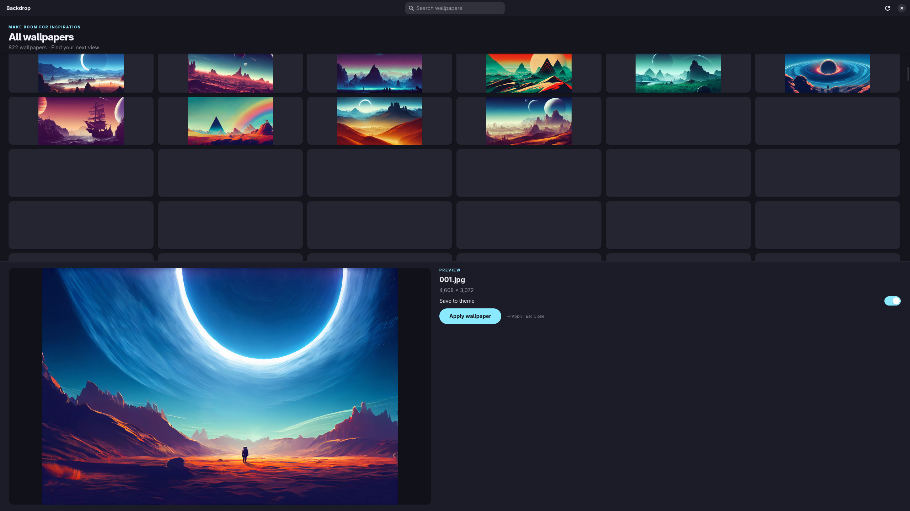

# Backdrop

A dark, focused **Pictures picker** for [Omarchy](https://omarchy.org/). Browse `~/Pictures`, search by filename, preview full-size, and apply a wallpaper without fighting Omarchy’s theme system.

Backdrop does **not** draw the desktop background. It only calls:

```sh
omarchy theme bg set /absolute/path/to/image
```

That is the same path Super+Ctrl+Space uses. Omarchy still owns rendering, transitions, and the live background plugin.

**Save to theme** is on by default. Apply copies the file into `~/.config/omarchy/backgrounds/<current-theme>/` with a collision-safe name, then sets that copy. Super+Ctrl+Space will see it on the next open. Turn the switch off to apply the original file in place.

The window is GTK 4 / libadwaita: sidebar collections, 16:9 thumbnail grid, large preview, Apply.



## Why it exists

Omarchy already has a background switcher (`omarchy theme bg-switcher`, bound to **Super+Ctrl+Space**). It only shows:

- `~/.local/state/omarchy/current/theme/backgrounds`
- `~/.config/omarchy/backgrounds/<theme-slug>/`

It is not a file picker for `~/Pictures`. Backdrop fills that gap. It does not replace Aether (theme-from-wallpaper) and does not edit anything under `/usr/share/omarchy/`.

## Requirements

- Omarchy (Hyprland + `omarchy` CLI)
- Python 3.11+
- System packages: `python-gobject`, `gtk4`, `libadwaita`
- No pip runtime dependencies, no network, no extra wallpaper daemon

On Omarchy these GI stacks are already installed.

## Install

From a clone:

```sh
python scripts/install.py
```

This copies the package to `~/.local/share/backdrop`, writes `~/.local/bin/backdrop`, installs the desktop entry and scalable icon. The desktop `Exec=` uses the absolute launcher path, so Familiar / any app grid finds it even when `~/.local/bin` is not on `PATH`.

Launch:

- Search **Backdrop** in the app launcher
- or `~/.local/bin/backdrop`
- or, from the repo: `PYTHONPATH=src python -m backdrop`

Re-run the installer after pulls. Preview a staging install with:

```sh
python scripts/install.py --home /tmp/backdrop-staging
```

## Use

| Action | How |
| --- | --- |
| Switch collection | Sidebar (All, Pictures, Agent Generated, Backdrops, Dracula, Theme, Saved) |
| Search | Header field, or Ctrl+F |
| Preview | Click a tile |
| Apply | **Apply wallpaper**, double-click, or Enter |
| Close | Escape |
| Refresh | Header refresh — rescans files and the current wallpaper |

Narrow windows collapse the sidebar behind a toggle.

### Collections

- **All** — recursive `~/Pictures`
- **Pictures** — top-level files only
- **Agent Generated**, **Backdrops**, **Dracula** — those folders under Pictures
- **Theme** — current Omarchy theme backgrounds
- **Saved** — `~/.config/omarchy/backgrounds/<theme-slug>/`

Skipped by default under Pictures: `Screenshots`, `Phone`, `Icons_Logos`, `GitKraken`, `Jetbrains`, `veteran_site`, hidden names, and directory symlinks (no loops).

Shown when the pixbuf loader supports them: PNG, JPEG, WebP, AVIF. SVG and TIFF are never applied. Unreadable files drop out of the grid as their thumbnail fails.

A **Current** badge marks the resolved `~/.local/state/omarchy/current/background`. A pinned copy is a different file, so the badge follows the copy in Saved, not the Pictures original.

## Keyboard

- **Enter** — apply selection
- **Esc** — close
- **Ctrl+F** — focus search
- **Arrows** — move in the focused grid

## How apply works

1. Optional pin: exclusive temp file under the theme extras directory, then rename-safe copy of bytes.
2. `omarchy theme bg set <absolute-path>` (list argv, no shell).
3. Omarchy updates `~/.local/state/omarchy/current/background` and IPC `omarchy-shell background set`.

Backdrop never calls `omarchy-shell background set` itself, never runs `sudo`, and never writes Hyprland config.

Theme slugs are read from `~/.local/state/omarchy/current/theme.name` and rejected unless they look like `[A-Za-z0-9][A-Za-z0-9_-]*`. Accent color is read from the current `colors.toml` when it is a `#RRGGBB` value.

## Performance

Thumbnails decode off the GTK thread (three workers), only when a card maps. Cache keeps 96 images. Thumbnails scale to 480px; preview to 1000px. The gallery crops 16:9; preview shows the whole image.

## Develop

```sh
python -m venv .venv --system-site-packages
. .venv/bin/activate
pip install pytest
python -m pytest
```

Tests mock every `omarchy` invocation and pixbuf load. They never change the live wallpaper. Core tests also run with `python -m unittest discover -s tests`.

Layout: `src/backdrop/` (GTK app + Omarchy wrapper), `tests/`, `data/` (desktop file + icon), `scripts/install.py`.

## What this is not

- Not a wallpaper compositor (no swww/hyprpaper of its own)
- Not a theme generator (use Aether if you want a palette from an image)
- Not an Omarchy plugin; it is a standalone GTK app

## License

Personal Omarchy tool. No license file yet — ask before redistributing.
